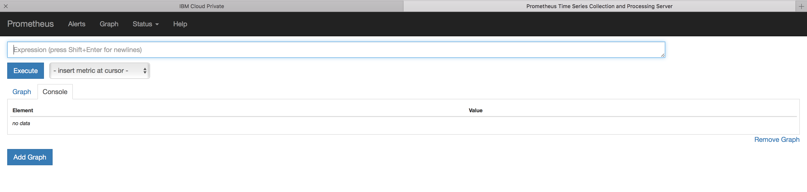

# Accessing the Prometheus console

ICp embeds Prometheus for alerting and metric collecting purpose.

ICp console menu proposes an access to AlertManeger ( `Platform -> Alerting`)

If you want to have an access to Prometheus console, you could use the following address:
`https://cluster_ip:8443/Prometheus`

