# First steps with Jenkins on IBM Cloud private

In this page, I describes how to deploy and configure Jenkins on IBM Cloud private. Then, in a second time, how I use this Jenkins instance to build a docker image and push it to the ICP private registry.

### Deploy Jenkins instance from ICp catalog.
NB: In this second, I describe steps by using ICp console. The same steps could be done by using command line.

1. Create a persitent volume, named `jenkins-home` to host the Jenkins data.
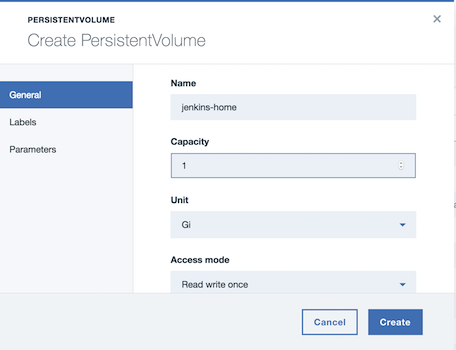
  Here, I create a PV with 1Gi capacity on HostPath. Depending of your environment, you select different storage and capacity. If you are thinking about use StorageClass, you could directly to step 2, creation of a PVC.

2. Create a Persitent Volume Claim (PVC)
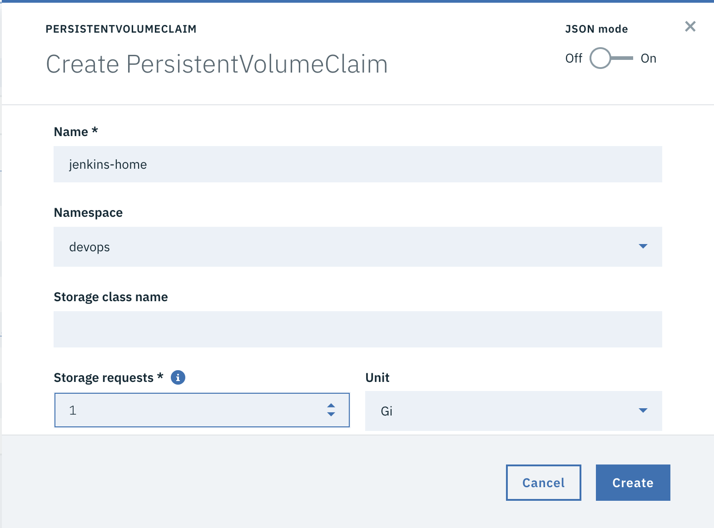

3. Browse the ICp catalog to localise Jenkins
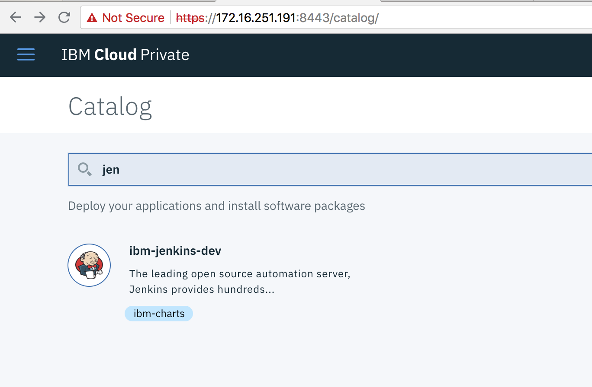

4. Click on the Jenkins service and read the page.

5. Click on `Configure`.

6. Fill the wizard with your values (name, namespace). On the persistance section, enter the name of the PVC that was created at step 2 in the field .
`Existing volume claim`.

7. Click on `Install`.

8. Verify the Helm chart deployment.
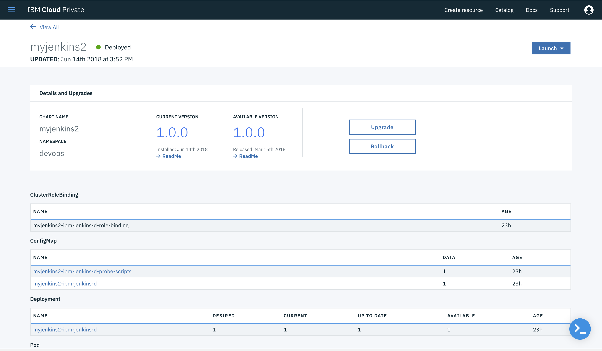

Once all the pods and resources are deployed corrected, you could start Jenkins configuration.

### Configure Jenkins instance
1. Obtain the password of Jenkins admin.
`printf $(kubectl get secret --namespace <YOUR_NAMESPACE>  <YOUR_JENKINS_SECRET> -o jsonpath="{.data.jenkins-admin-password}" | base64 --decode); echo`
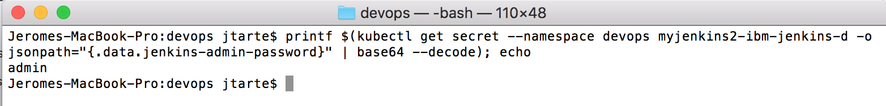

2. Log on Jenkins console.

3. Go to `Manage Jenkins` -> `Configure System`

4. Increase the `Container Cap`of Kubernetes section.
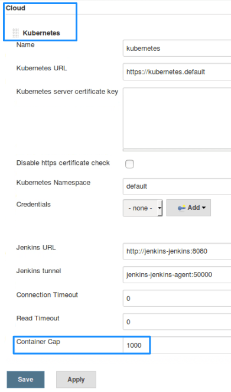

  Jenkins creates pods to run jobs, sometimes creating multiple containers until one can run successfully. The default container cap is set to 10, which can cause errors if multiple containers fail to be created. Increase the cap to 1000.

5. Save the configuration.

### Create your first pipeline
The sample that is described here collect source code from a git repository, do the Docker build and push the image in the ICp private registry.

1. From the Jenkins console, click on `create new jobs`.
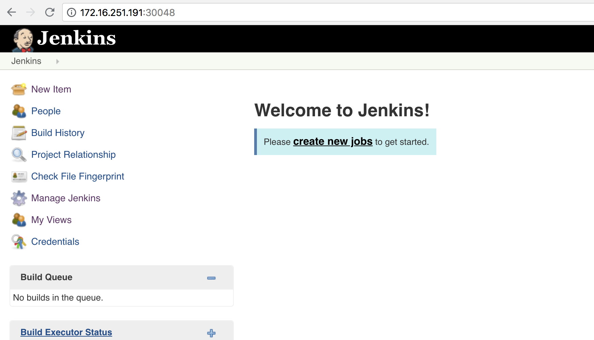

2. Enter the name of your pipeline and select `Freestyle project`.
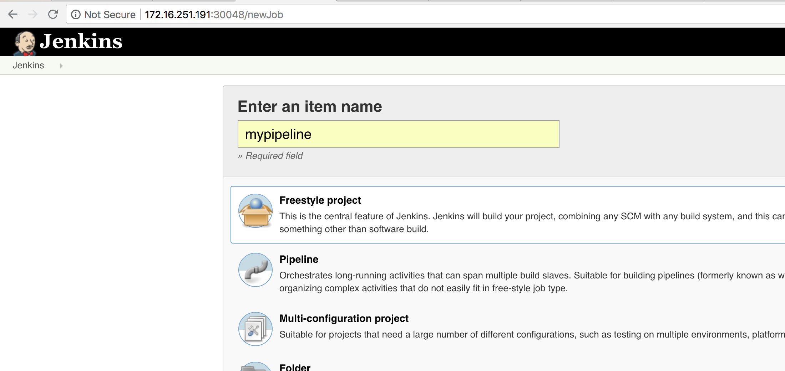

3. On the `Source Code Management`section, select `Git` and provide repository url and branch information.

4. On the `Build`section, select `Docker Build and Publish`.
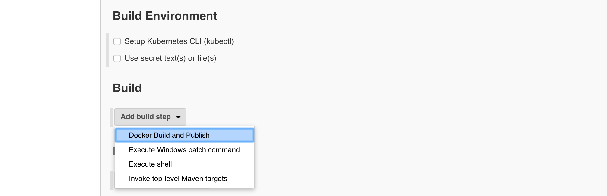

5. Fill the `Docker Build and Publish` form with repository name, Docker repository url and registry credentials.

6. Save your pipeline.

7. Click on 'Build Now'.

8. If your build is finished, you click on it to check what it happens. If the build failed, you could get information about the source of the failure.
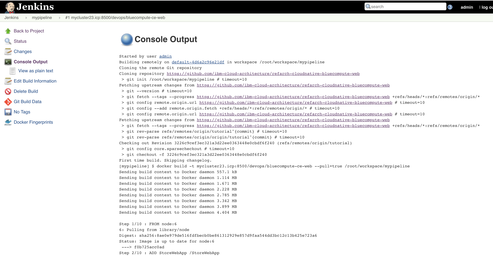

9. Go to ICp console on `Images` page. You should see the image Jenkins has built.
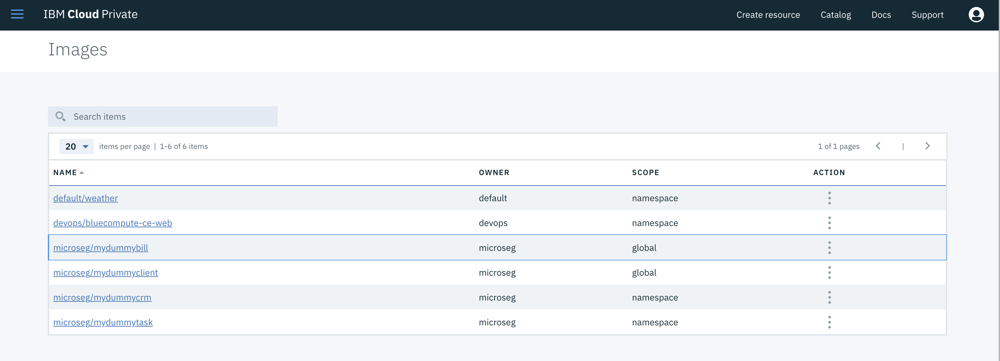
