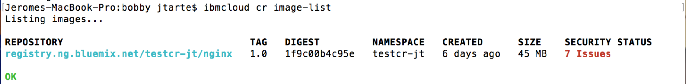
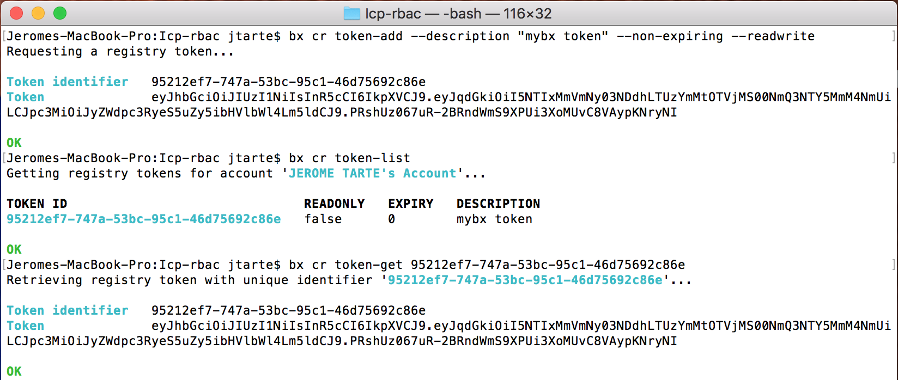
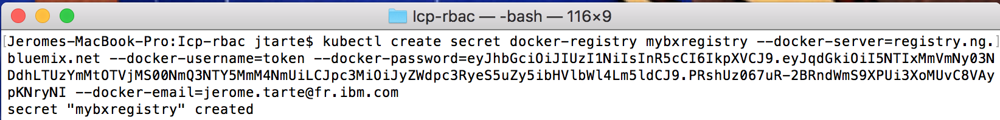
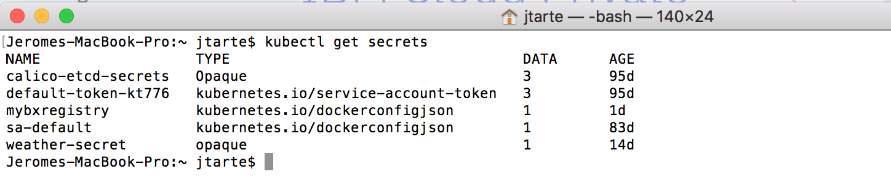
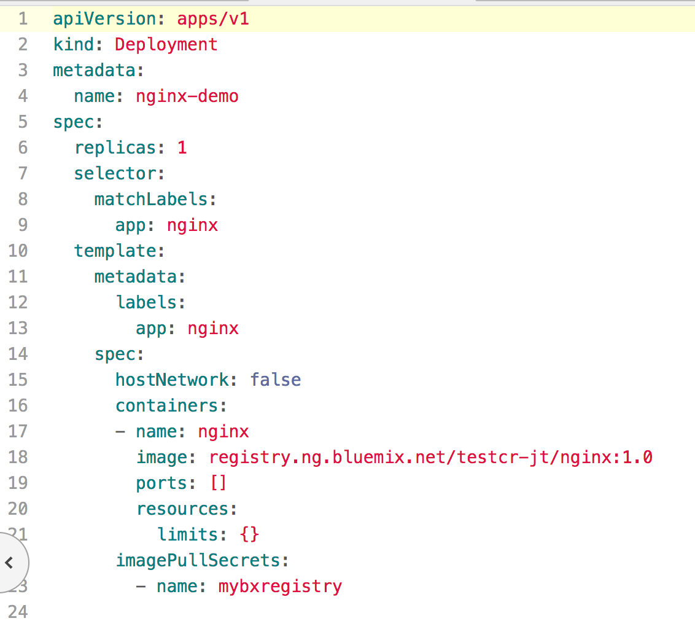
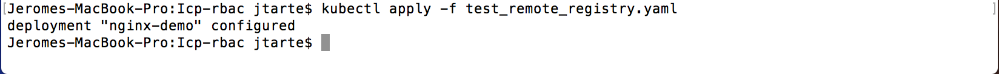
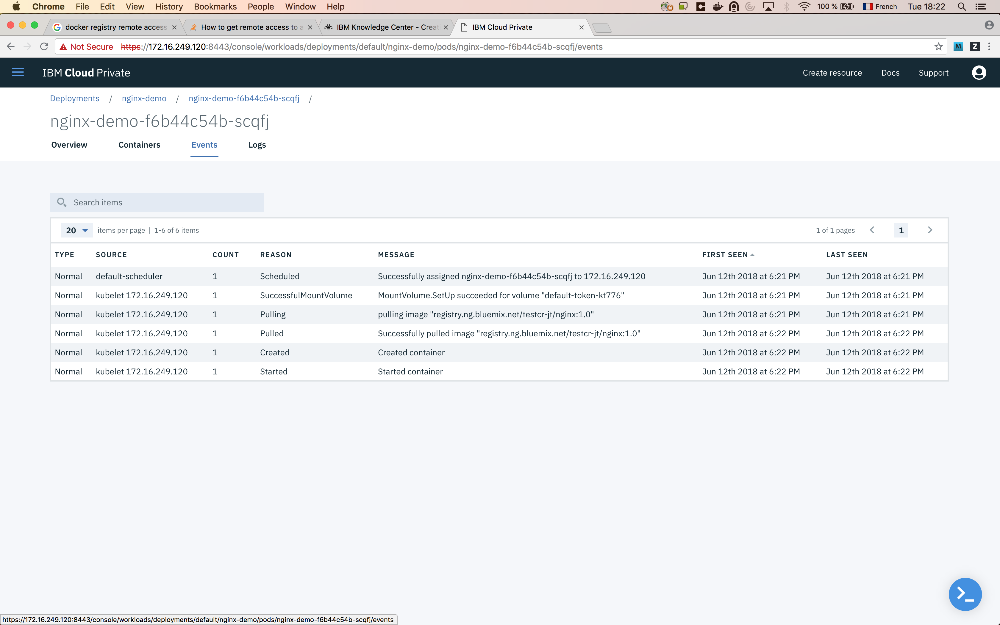

# Pulling images from a remote secure docker registry

All the images that you will use for the deployment of your workload are not necessary present on the local docker registry. You should be able to pull image from a remote registry. This one could be secured and could require a kind of authentication.

The following sample show how to pull images from an IBM Cloud Container Registry during a deployment made on your IBM Cloud private instance.

In this sample, I have a private IBM Cloud Container Registry named `testcr-jt`. Inside this registry, I have an image named `nginx:1.0`. So the full name of the image docker I will use is `registry.ng.bluemix.net/testcr-jt/nginx:1.0`.

The first part (step 1 to 3) is relative to IBM Cloud. On other docker registry, equivalents steps should be made in order to retrieve the authentication token that will be used to access to the registry. On IBM Cloud, I did the action with command line tools (the new command name  `ibmcloud` or the old one `bx`)

1. Login on IBM Cloud.
 ```
 bx login
 ```

2. Check the available images.
```
bx cr image-list
```


3. Get the authentication token.
```
bx cr token-add --description "mybx token" --non-expiring --readwrite
```


  From now the actions will be done on the IBM Cloud private (ICp) instance.

4. Configure your command line environment with ICp variables.

5. Create the `imagepullsecret` storing the remote registry token.
```
kubectl create secret docker-registry mybxregistry --docker-server=registry.ng.bluemix.net  --docker-username=token --docker-password=<$TOKEN> --docker-email=<$YOUR_EMAIL>
```


6. Check the secret creation.
```
kubectl get secrets
```


7. Use the `imagepullsecret` into your deployment file.


8. Do the deployment of your workload.
```
kubectl apply -f <$YOUR_DEPLOIMENT_FILE>
```


9. (Optional step) Check how the deployment steps. From the ICp console, on the `event` of the pod, you could check the different steps of the deployment, including the pull from the remote registry.

