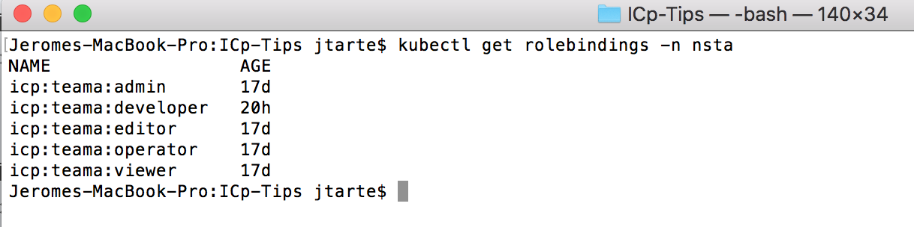
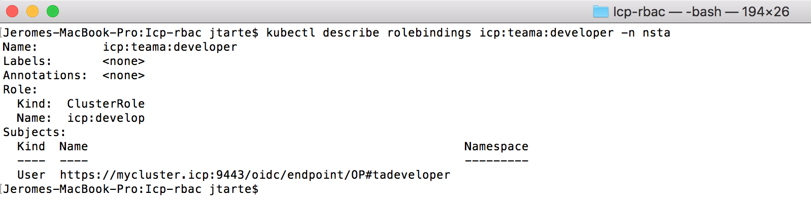
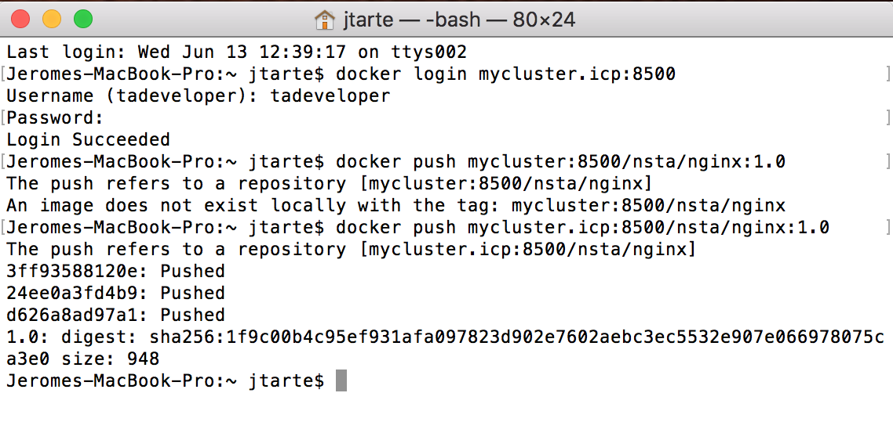

# Provide additional priviledges to an user

IBM Cloud private (and Kubernetes) comes with a RBAC mechanism. So the users of the plaform have some priviledges, depending of their profiles.
If, for some functional reasons, you need to grant additional priviledges to an user, it is possible by using roles (`clusterroles` or `roles) and binding (`clusterrolebindings` and `rolebindings`).

In this entry, I cover the functional case where
a developer needs to push images in the ICp image registry but have no other priviledges on ICp platorm except the view.

1. Create an user with `viewer` profile.

  The sample in this page is base on an user `tadeveloper` who is member of `teama` and has namespece `nsta` as resources.

2. Create a file describing the new `clusterroles` providing additional priviledges.
  ```
  kind: ClusterRole
  apiVersion: rbac.authorization.k8s.io/v1
  metadata:
    name: icp:develop
    labels:
        kubernetes.io/bootstrapping: rbac-defaults
        rbac.icp.com/aggregate-to-icp-view: "true"
  rules:
  - apiGroups: ["icp.ibm.com"]
    resources: ["images"]
    verbs: ["create", "get", "list", "patch", "update", "watch", "delete"]
  ```
  The new cluster role,named `icp:develop` is an aggreation of cluster role `icp:view` and the new priviledges added on top the `icp:view` cluster role

3. Create the new `clusterroles`.
```
kubectl apply -f developer-clusterroles.yaml
```
4. Check the `clusterroles`.
```
kubectl get clusterrolebindings
```


5. Create the role binding for `tadeveloper`on clusterroles `icp:develop`.
```
kubectl create rolebinding icp:teama:developer --clusterole=icp:develop --user=tadeveloper --namespace=nsta
```


6. Check the role binding on your target namespace.
```
kubectl describe rolebindings icp:teama:developer -n nsta
```


7. verify that `tadeveloper could now push images on the ICp image registry.


Basically, as tadeveloper was created as a viewer, he could not initially push images to the registry. But by binding him to the `icp:develop` cluster role in his namespace `nsta`, he could now push images to namespace `nsta`.


In this sample, I created a cluster roles in order to be able to reuse this role in several in namespace across the cluster. But the binding is done at role level in order to limit the new priviledges to the target namespace. If, in another namespace, I need similar `icp:developer`priviledges, I could do the binding at the new namespace level.  
