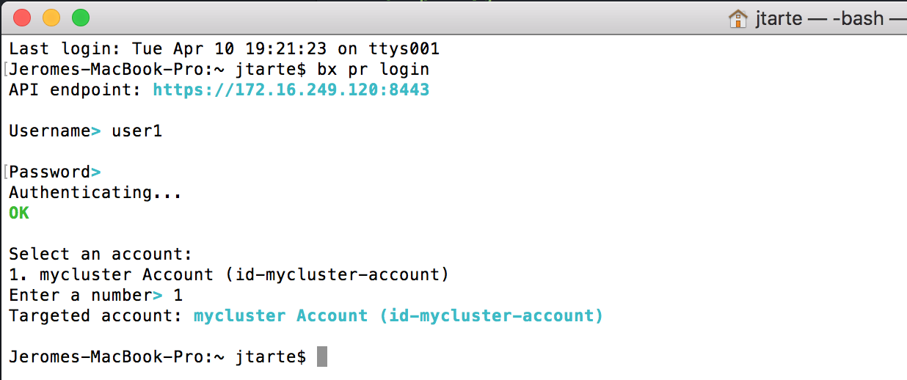
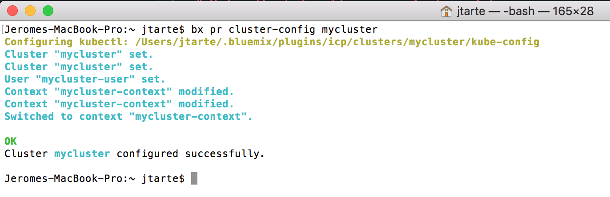
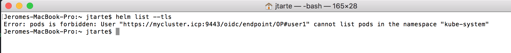
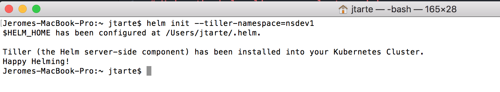
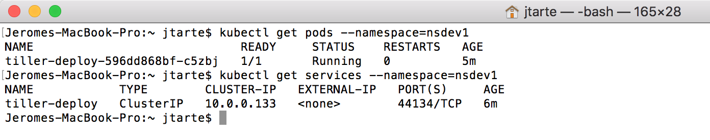
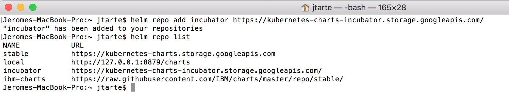
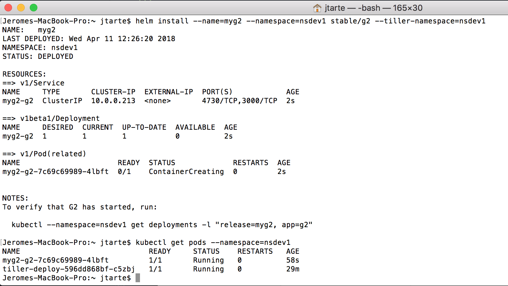
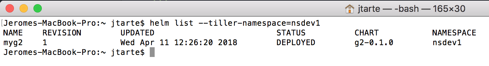

# Using the helm cli as non cluster-admin user

As described on IBM Cloud private (ICp) Knowledge Center, a non cluster-admin user (operator or administrator of a team) could use helm cli to deploy helm chart. But he needs to have priviledges on `kube-system`.

If you are willing to use helm CLI to deploy but your user doesn't get  priviledges on `kube-system`, there is a way to proceed. This page illustrates how to use the helm CLI to enable this feature.

The idea is to use another tiller that the one deployed in `kube-system`. The user when he initializes his helm CLI could ask for the deployment of a tiller instance in a namespace under user control then he could use this tiller instance to do helm chart deployment.

#### Initializes you helm CLI
Open a terminal session.

Login to your ICp instance:
```
bx pr login
```
Provide the user info to login: 

In this tutorial, I'm using `user1` who is a team administrator of `team1`. `team1`has `nsdev1`namespace as resource:


Get cluster information:
```
bx pr cluster-config mycluster
```


Verify that `user1` is not allowed to work with the default tiller, deployed in the `kube-system`:
```
helm list --tls
```



Initialize the helm cli by providing a namespace where a tiller instance  will be deploy:
```
helm cli --tiller-namespace=nsdev1
```



It will deploy a tiller instance in `nsdev1` namespace and the associated service.



#### Add a helm repo
If needed, add helm repository. By default, you get the ICp repositories (Local and IBM-charts).

The following command show how to add another repository.
```
helm repo add incubator https://kubernetes-charts-incubator.storage.googleapis.com/
```
Check the available repository:
```
helm repo list
```



#### Deploy a helm chart

Deploy `g2` helm chart from Kubernetes stable repository:
```
helm install --name=myg2 --namespace=nsdev1 stable/g2 --tiller-namespace=nsdev1
```

Check on you ICp instance:
```
kubectl get pods --namespace=nsdev1
```


Check your helm deployment:
```
helm list --tiller-namespace=nsdev1
```

